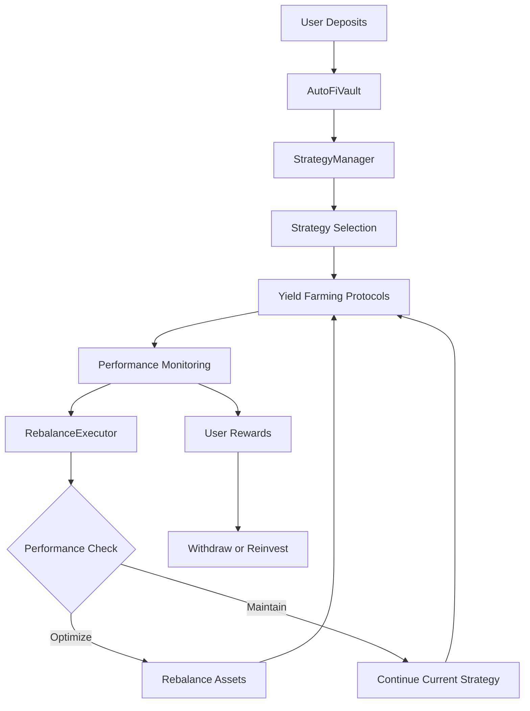

# AutoFi-Nexus Architecture Documentation

## 🏗️ System Architecture Overview

AutoFi-Nexus is a comprehensive DeFi automation platform designed to optimize yield farming strategies through intelligent asset management and automated rebalancing. The system consists of three main layers:

### 1. Smart Contract Layer (Phase 1)
- **AutoFiVault**: Core vault management
- **StrategyManager**: Strategy coordination and allocation
- **RebalanceExecutor**: Automated rebalancing logic

### 2. Frontend Layer (Phase 2)
- **React Dashboard**: User interface and portfolio management
- **Real-time Analytics**: Performance tracking and visualization
- **Mobile Interface**: Cross-platform accessibility

### 3. Automation Layer (Phase 3)
- **Vincent Agent Integration**: AI-powered strategy optimization
- **External Data Feeds**: Market data and protocol analytics
- **Automated Execution**: Strategy deployment and management

## 🔄 System Flow Diagram



## 📊 Core Components

### AutoFiVault Contract

**Purpose**: Central vault for managing user assets and coordinating with strategies.

**Key Responsibilities**:
- User deposit/withdrawal management
- Asset custody and security
- Strategy execution coordination
- Performance tracking and reporting

**Security Features**:
- 7-day lock period for deposits
- Minimum deposit requirements
- Emergency pause functionality
- Owner controls and emergency withdrawals

### StrategyManager Contract

**Purpose**: Manages multiple yield farming strategies and their allocations.

**Key Responsibilities**:
- Strategy registration and validation
- Dynamic allocation management
- Performance tracking and scoring
- Risk management and controls

**Strategy Types Supported**:
- Lending protocols (Aave, Compound)
- Liquidity provision (Uniswap, SushiSwap)
- Yield farming (Yearn, Harvest)
- Cross-protocol strategies

### RebalanceExecutor Contract

**Purpose**: Executes automated rebalancing based on strategy performance.

**Key Responsibilities**:
- Performance analysis and comparison
- Automated rebalancing triggers
- Risk management and safety checks
- Emergency rebalancing capabilities

**Rebalancing Triggers**:
- Performance threshold breaches
- Market condition changes
- Risk metric violations
- Time-based rebalancing

## 🔐 Security Architecture

### Multi-Layer Security

1. **Smart Contract Security**
   - Reentrancy protection
   - Access control mechanisms
   - Input validation and sanitization
   - Emergency pause functionality

2. **Operational Security**
   - Multi-signature requirements
   - Time-locked administrative functions
   - Regular security audits
   - Incident response procedures

3. **Financial Security**
   - Asset segregation
   - Risk limits and controls
   - Insurance mechanisms
   - Liquidity management

### Risk Management Framework

**Risk Categories**:
- Smart contract risk
- Protocol risk
- Market risk
- Liquidity risk
- Operational risk

**Mitigation Strategies**:
- Diversified strategy allocation
- Dynamic risk scoring
- Automated risk monitoring
- Emergency response protocols

## 📈 Performance Optimization

### Strategy Selection Algorithm

```javascript
function selectOptimalStrategy(strategies, marketConditions) {
  return strategies
    .filter(strategy => strategy.isActive)
    .map(strategy => ({
      ...strategy,
      score: calculatePerformanceScore(strategy, marketConditions)
    }))
    .sort((a, b) => b.score - a.score)
    .slice(0, maxStrategies);
}
```

### Rebalancing Logic

**Performance Metrics**:
- APY (Annual Percentage Yield)
- Risk-adjusted returns
- Liquidity score
- Protocol reliability score

**Rebalancing Conditions**:
- Performance deviation > threshold
- Risk metric violation
- Market condition changes
- Time-based triggers

## 🌐 Integration Architecture

### External Protocol Integration

**Supported Protocols**:
- **Lending**: Aave, Compound, Cream
- **DEX**: Uniswap V2/V3, SushiSwap, Curve
- **Yield**: Yearn, Harvest, Convex
- **Cross-chain**: LayerZero, Wormhole

**Integration Pattern**:
```solidity
interface IStrategy {
    function deposit(uint256 amount) external;
    function withdraw(uint256 amount) external;
    function getBalance() external view returns (uint256);
    function getAPY() external view returns (uint256);
}
```

### Data Feed Integration

**Price Oracles**:
- Chainlink price feeds
- Uniswap TWAP oracles
- Band Protocol oracles
- Custom oracle solutions

**Performance Data**:
- Protocol APY feeds
- Risk metrics
- Liquidity data
- Market sentiment indicators

## 🔄 Automation Workflow

### 1. Deposit Flow
```
User Deposit → Vault Validation → Asset Allocation → Strategy Execution → Performance Tracking
```

### 2. Rebalancing Flow
```
Performance Analysis → Risk Assessment → Strategy Comparison → Rebalance Execution → Update Tracking
```

### 3. Withdrawal Flow
```
Withdrawal Request → Lock Period Check → Asset Recovery → Strategy Exit → User Payout
```

## 📊 Monitoring & Analytics

### Real-time Metrics
- Total Value Locked (TVL)
- Strategy performance scores
- Risk metrics and alerts
- User activity patterns

### Historical Analytics
- Performance trends
- Risk evolution
- Strategy effectiveness
- Market correlation analysis

### Alert System
- Performance threshold breaches
- Risk metric violations
- System health monitoring
- Security incident alerts

## 🚀 Scalability Considerations

### Horizontal Scaling
- Multi-strategy support
- Cross-chain deployment
- Modular architecture
- Plugin system for new protocols

### Performance Optimization
- Gas-efficient operations
- Batch processing
- Optimized data structures
- Caching mechanisms

### Future Enhancements
- Layer 2 integration
- MEV protection
- Advanced analytics
- AI-powered optimization

## 🔧 Development Roadmap

### Phase 1: Core Infrastructure ✅
- [x] Smart contract development
- [x] Testing and security audit
- [x] Local deployment setup
- [x] Basic documentation

### Phase 2: Frontend Development 🚧
- [ ] React dashboard
- [ ] Real-time analytics
- [ ] Mobile interface
- [ ] User onboarding

### Phase 3: Automation & AI 🤖
- [ ] Vincent agent integration
- [ ] Advanced strategy optimization
- [ ] Predictive analytics
- [ ] Automated execution

### Phase 4: Ecosystem Expansion 🌍
- [ ] Cross-chain deployment
- [ ] Protocol partnerships
- [ ] Community governance
- [ ] Token economics

## 📋 Technical Specifications

### Smart Contract Requirements
- **Solidity Version**: ^0.8.19
- **Hardhat Framework**: Latest stable
- **OpenZeppelin**: Security libraries
- **Gas Optimization**: < 3M gas per deployment

### Frontend Requirements
- **React**: ^18.0.0
- **TypeScript**: Full type safety
- **Web3 Integration**: ethers.js v6
- **UI Framework**: Tailwind CSS

### Infrastructure Requirements
- **Node.js**: ^18.0.0
- **Database**: PostgreSQL for analytics
- **Caching**: Redis for performance
- **Monitoring**: Grafana + Prometheus

## 🎯 Success Metrics

### Technical Metrics
- Contract gas efficiency
- System uptime (99.9%+)
- Response time (< 2s)
- Error rate (< 0.1%)

### Business Metrics
- Total Value Locked (TVL)
- User retention rate
- Average yield generated
- Risk-adjusted returns

### User Experience Metrics
- User onboarding completion
- Feature adoption rate
- User satisfaction score
- Support ticket volume

---

*This architecture document serves as the foundation for AutoFi-Nexus development and will be updated as the system evolves.*